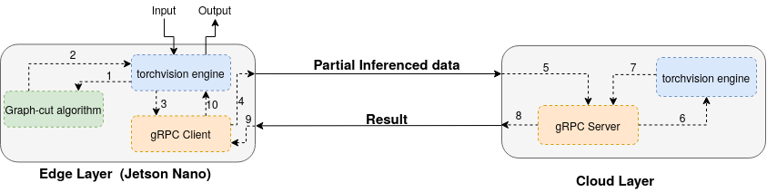
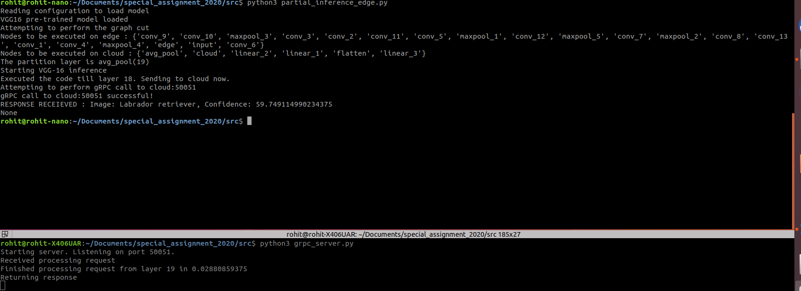
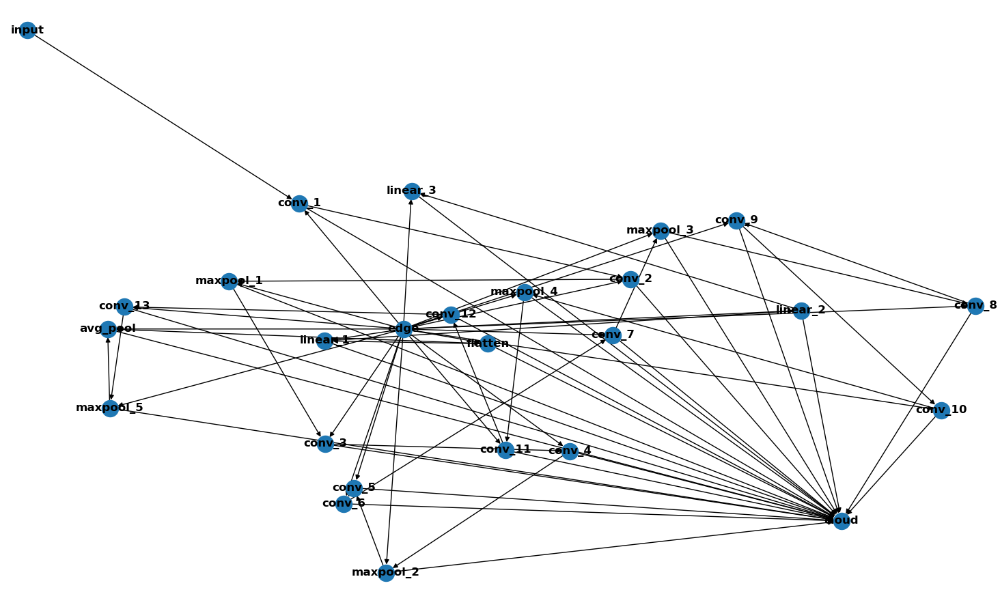
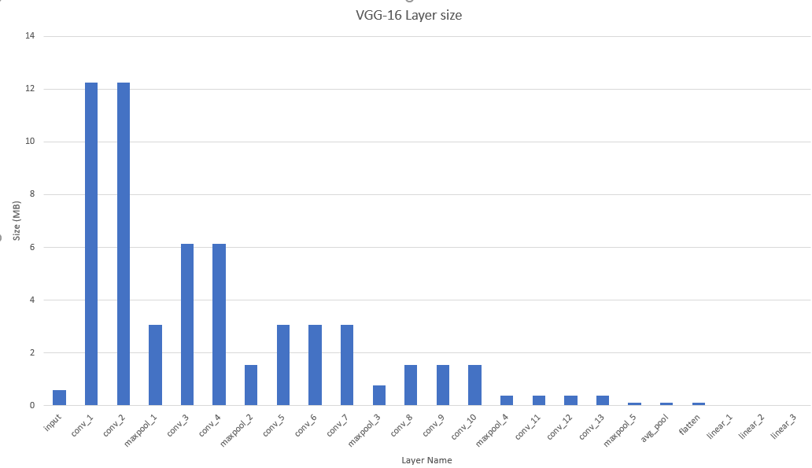
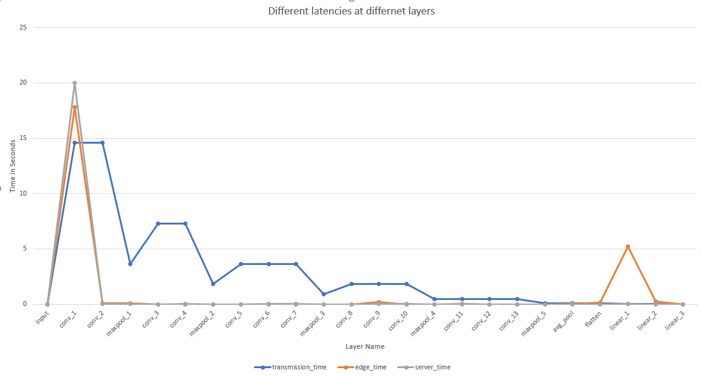

### Dynamic Adaptive DNN Surgery for Inference Acceleration on the Edge

This is the implementation of DNN Surgery Light (DSL) algorithm originally published by Chuang Hu _et. al._ in  IEEE INFOCOM 2019 [1]. 

#### Implementation details

It has been implemented in python3 using [pytorch](pytorch.org) DNN library. This implementation uses VGG-16 as the underlying architecture and the function calls have been made using gRPC protocol (as per the original paper). It automatically uses CUDA cores if available on the device.

The implementation essentially converts the original graph to a minimum _s-t_ cut problem. This implementation performs the cut using [Boykov Kolmogorov](discovery.ucl.ac.uk/13383/1/13383.pdf) algorithm. The bandwidth has been measure using [iperf3](https://iperf.fr/) tool.

#### Architecture
A rough architecture and the overall data-flow has been summarized in the figure below.


* Figure 1 : Architecture and data flow of the implementation

#### Requirements
We require the following dependencies on the edge device:
* pytorch
* gRPCio and gRPCio-tools
* networkx
* pyYaml and
* matplotlib (_optional_)

Additionally, for running the server code, we require:
* pytorch
* gRPCio and gRPCio-tools

#### How to run
1. Install the  required dependencies on the respective system
2. Generate the required metadata using `generate_metadata.py` 
3. Update the `configuration.yaml` file 
4. For edge device, run `partial_inference_edge.py`
5. For cloud device, run `grpc_server.py` in background


* Figure 2: Running the code

#### Sample configuration file
The `configuration.yaml` file reads the necessary configuration about the server address and required model config. A sample `configuration.yaml` file should look like :

```YAML
model:
    architecture: VGG16
    path: "/home/rohit/vgg16-397923af.pth"
    classes: 1000
server:
    address: "cloud"
    port: "50051"

```

#### Results 


* Figure 3: Representation of VGG-16 graph to the minimum _s-t_ cut problem


* Figure 4 : Size of each layer


* Figure 5 : Latency of each layer
---
### References

[1] C. Hu, W. Bao, D. Wang and F. Liu, "Dynamic Adaptive DNN Surgery for Inference Acceleration on the Edge," IEEE INFOCOM 2019 - IEEE Conference on Computer Communications, Paris, France, 2019, pp. 1423-1431, doi: 10.1109/INFOCOM.2019.8737614.